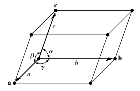
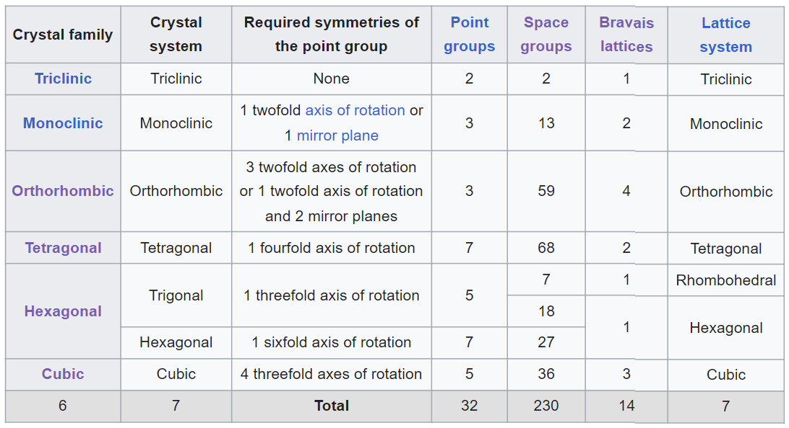
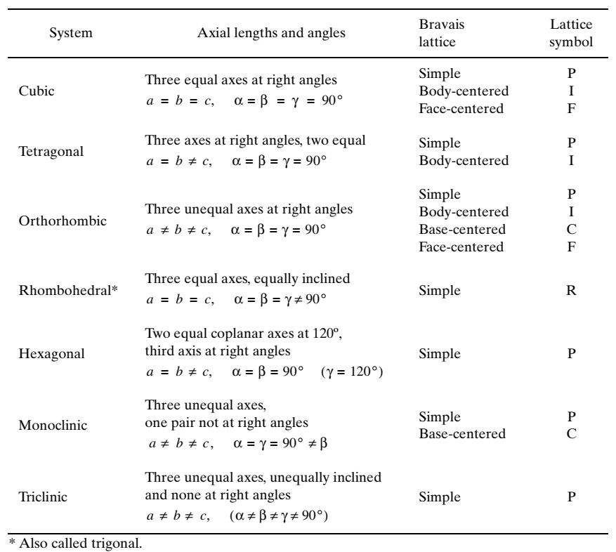
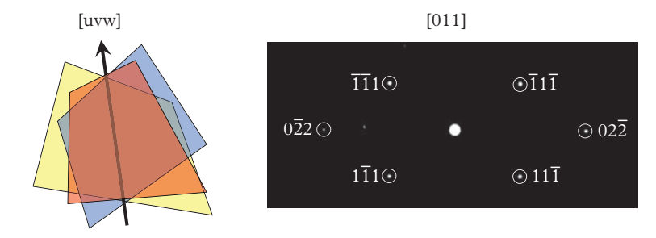
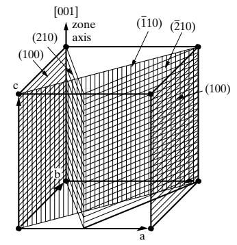

---
aliases:
  - crystal
  - crystal structure
share: "true"
---

$$\rm crystal = lattice + bases$$
# 7 lattice systems, 14 Bravais lattices

(Bravais) lattice is a periodic array in which the repeated units of the crystal cell are arranged. Bravais lattice consists of all points defined by position vectors 

$$\mathbf{R} = u \mathbf{a} + v \mathbf{b} + w \mathbf{c}$$, where $\mathbf{a}, \mathbf{b}, \mathbf{c}$ are non-coplanar vectors and $u,v, w$ are integers.

There are 7 lattice (crystal) systems, 14 three-dimensional Bravais lattices

| Lattice symbol | Name           | Coordinates                                            |
| -------------- | -------------- | ------------------------------------------------------ |
| P              | Primitive      | $(0,0,0)$                                              |
| I              | Inner centered | $(0,0,0), (1/2, 1/2, 1/2)$                             |
| F              | Face centered  | $(0,0,0), (0, 1/2, 1/2), (1/2, 0, 1/2), (1/2, 1/2, 0)$ |
| C              | Based centered | $(0,0,0), (1/2,1/2,0)$                                 |
| A              | Based centered | $(0,0,0), (0, 1/2, 1/2)$                               |
| B              | Based centered | $(0,0,0), (1/2, 0, 1/2)$                               | 

The number of lattice points per unit cell is given by 

$$N = N_i + \frac{N_f}{2} + \frac{N_c}{8}$$, where $N_i$ is the number of interior points, $N_f$ is the number of points on faces, and $N_c$ is the number of points on corners.

# Unit cell

## Primitive cell

- The primitive cell is a volume that fills space without overlapping itself or leaving voids. 
- **Each primitive cell has only one lattice point**
- The **volume** of the primitive cell is **unique**
- The **shape** and the **origin** of the primitive cell are ***not* unique**

## Non-primitive cell

- Unit cells which contain more than one lattice point are called non-primitive.
- The volume of a non-primitive cell must be an integer multiple of the primitive cell volume
- 7 of the 14 Bravais lattices are described in terms of non-primitive cells also known as *conventional cells*.

## Wigner-Seitz cell

The Wigner-Seitz cell is a *special* primitive cell which defines the volume of space about a Bravais lattice point that is closer to that point than any other points.

The recipe for construction is to connect Bravais lattice points with all other points and to bisect each of these lines with a perpendicular planes. The smallest polyhedron bounded by these planes is the Wigner-Seitz cell.

## Conventional cell

> [!Danger] Note
> Good table to recall fast anytime:
> 
> |                       | BCC  | FCC  | HCP  | SC   | DC   |
> | --------------------- | ---- | ---- | ---- | ---- | ---- |
> | number of atoms       | 2    | 4    | 6    | 1    | 8    |
> | coordination number   | 8    | 12   | 12   | 6    | 4    |
> | atomic packing factor | 0.68 | 0.74 | 0.74 | 0.52 | 0.34 |
> | octahedral sites  | 6 | 4 | 6 | | |
> | tetrahedral sties | 12 | 8 | 12 | | |

# Crystal structure = Lattice + Basis

All crystal structures consist of one of the 14 Bravais lattices plus a collection of atoms, the basis, that decorates each lattice point.

For any basis composed of $J$ atoms, there are a set of $J$ vectors $\left\lbrace \mathbf{r}_j\right\rbrace$, that specify the location of each atom in the basis with respect to a Bravais lattice point as fractional coordinates $$\mathbf{r}_j = x_j \mathbf{a} + y_j \mathbf{b} + z_j \mathbf{c}$$.

Every atom position in the crystal can be specified by the sum of a Bravais lattice vector and a basis vector ($\mathbf{R} + \mathbf{r}$) in space.

Translation and symmetry operation acting through a point specify the ***space group***. There are **17** *wallpaper (plane) groups* in two dimensions and **230** *space groups* in three dimensions.

| 2D              | 3D              |
| --------------- | --------------- |
| 10 point groups | 32 point groups |
| 17 plane groups | 230 space groups |

# Points, lines, and planes

- Points: Specific points within the unit cell are specified by three fractional coordinates $(x,y,z)$.
- Directions: Direction in the unit cell are specified by three integer indices $[u v w]$. Bar represents an opposite or negative direction. The family of directions, which depends on the Bravais lattice symmetry and the directions, is specified by $\left\langle uvw\right\rangle$
- Planes: Indices for plane, or called *Miller indices* $(hkl)$, are the reciprocals of axis intercepts, cleared of common fractions and multipliers.  Set of identically spaced, indistinguishable planes belong to the same family and are specified by $\left\lbrace hkl\right\rbrace$.

> [!danger]
> The direct space vector $[hkl]$ in non-cubic systems will not necessarily be perpendicular to $(hkl)$

# Zonal equation

***Planes of a zone*** are planes which are all parallel to one line called ***zone axis***, which is also the incident beam direction!

# Reciprocal lattice

Vector in reciprocal lattice $\mathbf{g}_{hkl}$ is normal to the set of planes with the Miller indices $\left(hkl\right)$. Thus $\mathbf{g}_{hkl}$ can be written in terms of the unit cell vectors of the reciprocal lattice as 

$$\mathbf{g}_{hkl} = h \mathbf{a}^\star + k \mathbf{b}^\star + l \mathbf{c}^\star$$

, where the basis of the reciprocal lattice is 

$$\begin{align*}
\mathbf{a}^\star &=  \frac{2\pi\mathbf{b}\times \mathbf{c}}{\left| \left(\mathbf{a}\times \mathbf{b}\right)\cdot \mathbf{c}\right|}\\
\mathbf{b}^\star &=  \frac{2\pi\mathbf{c}\times \mathbf{a}}{\left| \left(\mathbf{a}\times \mathbf{b}\right)\cdot \mathbf{c}\right|}\\
\mathbf{c}^\star &=  \frac{2\pi\mathbf{a}\times \mathbf{b}}{\left| \left(\mathbf{a}\times \mathbf{b}\right)\cdot \mathbf{c}\right|}
\end{align*}$$. The length of reciprocal vector $\left|\mathbf{g}_{hkl}\right|$ is therefore 

$$\boxed{\left|\mathbf{g}_{hkl}\right| = \frac{2\pi}{d_{hkl}}}$$

# Symmetry

## Translation

## Rotation

> [!Danger] Crystallographic restriction theorem 
>  
> $$2a\cos \theta = 2a \cos \frac{2\pi}{n} = m \in \mathbb{N}$$

## Reflection

## Inversion

## Roto-inversion

Different symmetry operation acting through a point are termed ***point group***. 
- In two dimension there are **10 point groups**.
- In three dimensions there are **32 point groups**.

# Primitive and non-primitive cells

# Miller-Bravais indices

To give similar indices to similar planes and entail the information of symmetry in hexagonal system, the Miller-Bravais indices $(hkil)$ are used. In Miller-Bravais four coordinate system, three $\mathbf{a}_1, \mathbf{a}_2, \mathbf{a}_3$ axes are all contained in the *basal plane* and are at $120^\circ = 2\pi/3$ to one another. Since the index $i$ is the reciprocal of the fractional intercept on $\mathbf{a}_3$ axis, the value of $i$ depends on the values of $h$ and $k$. The conversion from three-index system to the four index system as $[UVW]\rightarrow[hkil]$ is $$\begin{align*}
h &= \frac{1}{3}\left(2U - V\right) &\qquad U &= h-i \\
k &= \frac{1}{3}\left(2V - U\right) &\qquad V &= k-i \\
i &=  -(h + k) = -\frac{1}{3}\left(U +V\right)\\
l &= W &\qquad W &= l \\
\end{align*}$$.

# Substitutional compounds

## Substitutional BCC: CsCl 

ionic solids: CsCl
intermetallic compounds: CuZn ($\sf \beta-brass$)

## Substitutional FCC: Perovskite $\sf Cu_3Au$ 

> [!warning]
> Strong ionicity is unlikely since like ions occupying Cu positions would be nearest neighbors of one another, and their mutual repulsion would cause the structure to have a relatively high energy.

Perovskite: compounds ions are distributed over octahedral interstitial sites
# Interstitial compounds

## Octahedral interstices in FCC: NaCl

Natural choice for equivalent ionic compounds: NaCl, MgO

## Tetrahedral interstices in FCC: Zinc-blende $\sf \beta-ZnS$

*Sphalerite* (*Zincblende*) structure, binary analog of the diamond cubic (DC) structure
Natural choice for covalently bonded binary compounds

- Important for engineering: 
	- III-V [semiconductors](semiconductors.md): GaAs, InSb
	- II-VI [semiconductors](semiconductors.md): ZnS, CdS

## Tetrahedral interstices in HCP: Wurtzite $\rm Ć-ZnS$

***Wurtzite***, analog to lonsdaleite

$\rm Ć-ZnS$ tends to be electrical [insulators](insulators.md) with large band gaps.

## Tetrahedral interstices in BCC: A15 structure $\rm Nb_3Sn$

A15 superconductors

Separated chains of tetrahedral atoms provide easy pathways for current flow.

## Order of interstitial compounds

